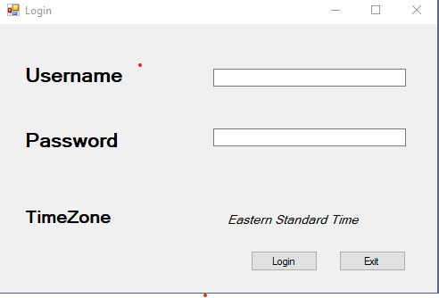
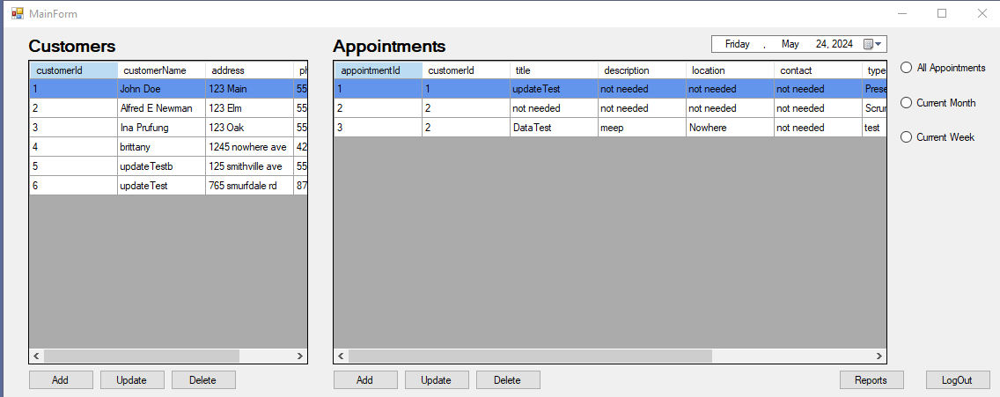
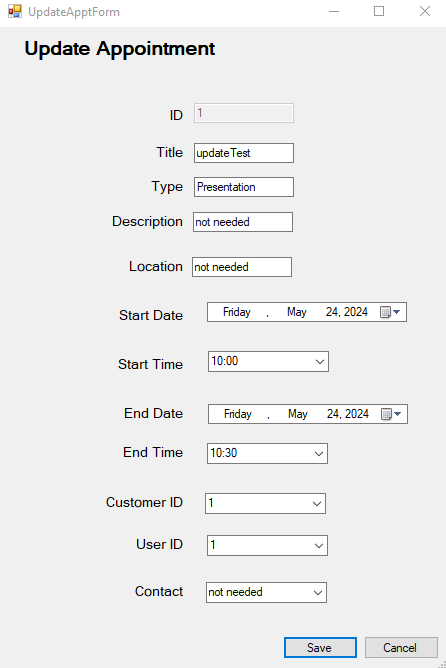
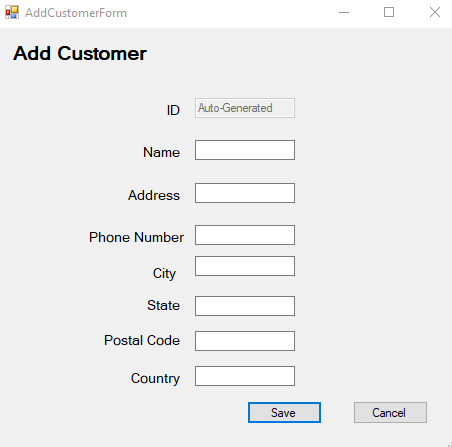

##Scheduling Application

## Description

This is a scheduling application that allows users to create, update, and delete appointments. The application also allows users to view appointments by month, week or specific day. The application also has a feature that allows users to view appointments by type.

## Technologies

-C#
-MySQL

---

